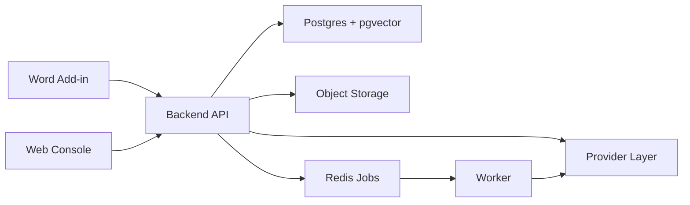

# Open Contracts for Canada - Engineering Spec

Status: Draft  
Updated: 2026-04-20  
Scope: Solo-first product architecture for the current Skua monorepo  
Related:
- `docs/specs/open-contracts-endpoint-contracts.md`
- `docs/specs/open-contracts-word-addin-wireframes.md`

## 1. Objective

Define the target architecture for a Word-native contract review copilot for solo lawyers and very small firms.

The first real product is narrow:

- open a contract in Word
- run a playbook-based review
- ask cited questions
- revise clause language
- apply comments or tracked changes
- save preferred fallback language
- reuse that language later

The web app is a support surface for auth, billing, settings, playbooks, clause bank, run history, and trust or spend controls. It is not the center of gravity.

## 2. Product Boundary

### In scope for v1

- Word-first contract review over full document or selection
- playbook-driven findings with citations
- cited Ask over the current agreement
- clause-level Revise actions with editable output
- saved fallback language and clause-bank retrieval
- optional hosted mode and BYOK mode
- lightweight matter and run history

### Out of scope for v1

- full diligence workspaces
- multi-reviewer deal rooms
- broad legal research
- benchmark or compare-to-market claims
- enterprise admin suites

## 3. Current Repo Baseline

The repo already contains useful foundations:

- `apps/word-addin` proves the Word task-pane shape
- `services/dd-api` already persists uploads, review runs, ask runs, draft runs, and suggestion actions
- `services/worker` already handles queue-backed background execution
- `packages/playbooks` already stores editable rules as files
- retrieval, standards, and audit plumbing already exist in prototype form

The repo also still contains legacy DD-oriented slices:

- `apps/review` mixes thin-console behavior with older diligence workspace panels
- workflow templates and DD report generation remain in the codebase
- route names and service paths still reflect earlier product framing

Those legacy pieces are transitional and not the target system shape.

## 4. System Shape

Use a thin-client plus API plus async jobs architecture.

### Primary surfaces

#### Word add-in

This is the main product surface.

Responsibilities:

- upload the current document or current selection
- trigger review, ask, and revise actions
- show findings, citations, and suggested edits
- apply comments or tracked changes in Word
- show saved fallback language and suggested replacements

#### Web console

This is a support surface.

Responsibilities:

- auth and account access
- billing and provider settings
- playbook editing
- clause bank and saved preferences
- matter and run history
- spend and trust controls

#### Backend API

This is the system of record for:

- users and workspaces
- matters and documents
- document versions and segments
- review, ask, and revise runs
- findings, citations, and clause bank entries
- provider configs, usage, and audit events

#### Async workers

Workers handle:

- parsing
- extraction
- review runs
- ask runs
- revise runs
- embeddings and retrieval indexing
- export and maintenance jobs

## 5. Runtime Architecture



### Recommended stack

- Word add-in: React plus Office.js
- web console: Next.js
- backend: FastAPI is the most natural fit given the current parsing and orchestration code
- relational state: Postgres
- file storage: S3-compatible object storage
- queue and cache: Redis
- vector retrieval: pgvector inside Postgres

Do not split into many deployable microservices yet. Use a modular monolith first.

## 6. Logical Service Boundaries

### Auth and account

- users
- workspaces
- memberships
- provider configs
- billing linkage

### Matters and documents

- matters
- document uploads
- document versions
- storage references
- parsed metadata

### Parsing and anchoring

- DOCX and PDF parsing
- section and clause segmentation
- paragraph anchors
- quote and span anchors for citations

### Review engine

- playbook-driven review runs
- structured findings
- severity and confidence
- suggested comments and redlines

### Ask and revise engine

- cited Q&A
- clause explanation
- clause rewrite
- selection-scoped operations

### Retrieval and memory

- clause bank
- saved fallback language
- preference signals
- retrieval over previously accepted language

### Usage and audit

- token usage
- cost estimates and actuals
- monthly summaries
- audit events and deletion traces

## 7. Core Domain Model

### User and workspace

- `User`
- `Workspace`
- `WorkspaceMembership`
- `ProviderConfig`

V1 should default to one workspace per user while still leaving room for small-firm memberships.

### Matter and document state

- `Matter`
- `Document`
- `DocumentVersion`
- `ParsedDocument`
- `DocumentSegment`

`DocumentSegment` is the core retrieval and citation unit. It should support headings, clauses, paragraphs, tables, and selection-derived spans.

### Review and citation state

- `Playbook`
- `ReviewRun`
- `Finding`
- `Citation`

### Ask and revise state

- `AskRun`
- `AskAnswer`
- `AskAnswerCitation`
- `ReviseRun`
- `ReviseResult`

### Memory and control state

- `ClauseBankEntry`
- `PreferenceSignal`
- `UsageLedger`
- `AuditEvent`

## 8. Document Pipeline

### 8.1 Ingest

Inputs come from:

- Word add-in full-document upload
- Word add-in current selection
- web upload

The API stores:

- original binary in object storage
- document and document-version rows in Postgres
- source metadata such as filename, mime type, and upload surface

### 8.2 Parse

For DOCX:

- preserve paragraph order
- capture heading styles where possible
- retain table boundaries
- retain OOXML identifiers when available

For PDF:

- extract text blocks and pages
- tolerate imperfect structure
- create paragraph-like fallback segments

Outputs:

- parsed-document record
- document segments
- anchor payloads for each segment

### 8.3 Index

- embed clause and paragraph segments
- store vectors in pgvector
- keep lexical fallback fields for plain-text retrieval
- mark indexing status complete

### 8.4 Run review, ask, or revise

Each run references:

- document version
- selected scope
- playbook and represented party when relevant
- provider policy and model choice
- cost budget or warning thresholds

Workers retrieve:

- relevant segments
- neighboring context
- playbook rules
- saved fallback language
- similar accepted or saved clauses when useful

### 8.5 Apply back to Word

The add-in receives:

- findings or revised text
- suggested comments or redlines
- citations and anchor payloads

Users can:

- accept
- dismiss
- edit before apply
- save clause language

Those actions write audit events and preference signals.

## 9. Review Engine

### Input contract

The review engine should take a structured request, not just raw document text:

- `document_version_id`
- `playbook_id`
- `scope`
- `represented_party`
- `contract_type`
- `provider_policy`
- `cost_budget`

### Internal stages

#### Scope preparation

- resolve relevant segments
- cluster by clause or section
- attach neighboring context
- attach applicable playbook rules

#### Issue extraction

- identify clause type
- compare text against playbook expectations
- identify issues, omissions, or risky wording
- capture exact supporting text

#### Action generation

- propose comment text
- optionally propose revised language
- label output as comment, redline, or informational

#### Citation validation

- ensure each finding maps to at least one source segment
- ensure quoted text matches stored spans
- reject unsupported claims

#### Ranking

- severity
- confidence
- likely usefulness
- likely acceptance

### Output contract

Return a structured list of findings. Avoid giant free-form memos in v1.

## 10. Ask and Revise

### Ask

Use Ask for questions like:

- what this clause allows
- whether a clause exists
- where a clause is located
- what is unusual for the represented party

Return:

- short answer
- confidence
- one to three citations
- optional next-question suggestion

### Revise

Use Revise for:

- make this supplier-friendly
- make this mutual
- shorten this clause
- make this consistent with a playbook

Return:

- revised clause text
- short explanation
- citations to the source clause and any retrieved fallback language that materially influenced the draft

Important rule: Ask and Revise never mutate the persisted document directly. Only explicit apply actions in the add-in should change the Word document.

## 11. Word Anchoring Strategy

Anchoring is a critical reliability problem.

Use multiple anchors for every actionable range:

- document version id
- paragraph ordinal
- quote text
- surrounding prefix and suffix
- OOXML marker when available

When re-locating an anchor:

1. try exact structural match
2. fall back to quote match
3. fall back to fuzzy neighborhood match

If none succeed confidently, the add-in should degrade gracefully and ask the user to reselect.

## 12. Clause Memory and Preference Signals

### Playbooks

Store playbooks as structured JSON or file-backed data with fields for:

- contract type
- represented party
- issue rules
- must-have clauses
- preferred fallbacks
- severity mapping
- drafting preferences

### Clause bank

Each saved clause should retain:

- clause text
- contract type
- issue type
- preferred side
- tags
- provenance
- last-used timestamp

### Preference learning

Start with a weighted retrieval layer:

- accepted suggestions raise ranking weight
- dismissed patterns lower ranking weight
- user-saved clauses outrank generic defaults

Do not build complex reinforcement loops in v1.

## 13. Cost Control and Security

### Cost controls

Hosted mode:

- use platform provider configs
- estimate runs from current pricing tables
- write actual usage into a usage ledger

BYOK mode:

- store encrypted provider-key references
- keep usage visibility even when billing is external
- allow workspace-level model policies

Guardrails:

- estimate token and cost before runs
- warn or block if thresholds are exceeded
- update monthly summaries after runs

### Security baseline

- HTTPS everywhere
- private object storage
- encryption at rest for secrets
- row-scoped authorization by workspace
- audit logging for key actions
- explicit deletion flows
- no training on user data
- provider disclosure in product surfaces

Defer SAML, SCIM, advanced retention, legal hold, and customer-managed keys.

## 14. Deployment Shape

Minimum production deployment:

- web console
- Word add-in static assets
- backend API
- worker service
- Postgres
- Redis
- object storage
- error monitoring and logging

Keep hosting simple. Managed services are fine. Do not introduce Kubernetes first.

## 15. Repo Evolution

The repo should evolve toward this shape without immediate path renames:

```text
apps/
  word-addin
  review
  chat
services/
  dd-api
  worker
  gateway
packages/
  playbooks
  schemas
  prompts
  sdk
  standards
  workflows
```

Important constraint: the current pass updates repo truth and product positioning, not filesystem paths or runtime variable names.

## 16. Release Slices

### Slice 1: usable internal alpha

- auth
- one workspace per user
- Word add-in upload
- document parse and segment storage
- one strong review playbook
- findings plus citations
- comment apply
- simple Ask
- hosted mode only

### Slice 2: private pilot

- better anchors
- tracked-change redlines
- clause bank
- spend estimates
- BYOK mode
- run history
- deletion controls

### Slice 3: paid beta

- multiple playbooks
- preference ranking
- re-review changed sections
- better cost dashboards
- matter list improvements
- trust page
- stable onboarding

## 17. Key Risks

- Word anchoring can drift.
- Citations will feel fake if quote validation is weak.
- Review quality will vary by contract type.
- Costs can expand unpredictably without scope-aware routing.
- Users may expect broad legal advice if the product framing becomes too open-ended.

The mitigation strategy is to stay narrow, cited, and Word-first.
