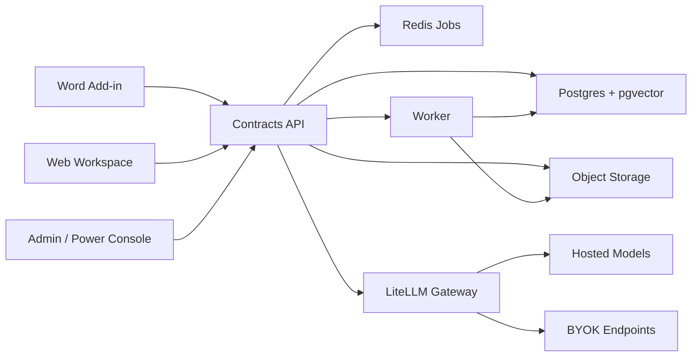

# Open Contracts for Canada - Engineering Spec

Status: Draft
Updated: 2026-04-19
Scope: Clean-room v1 engineering spec aligned to the current Skua monorepo
Related:
- `docs/specs/open-contracts-endpoint-contracts.md`
- `docs/specs/open-contracts-word-addin-wireframes.md`

## 1. Objective

Turn the PRD into an implementation-ready spec for a Word-first contract copilot and web-based deal memory workspace that can be built incrementally from the current repo.

The v1 product has two user surfaces:

- a Word add-in for single-document review, ask, draft, playbooks, and standards checks
- a web app for projects, library search, queries, workflows, and due diligence exports

The repo already contains an early web diligence slice:

- `apps/review` is the current Next.js review workspace
- `services/dd-api` is the current FastAPI orchestration service
- `packages/playbooks` already stores editable YAML files
- `packages/schemas` already defines shared contracts

This spec keeps those strengths, then expands the system toward the Word-first product shape in the PRD.

## 2. Product Scope

### P0

- Word add-in shell and authenticated session
- Review runs over full document or selection
- Suggestion list with comment and redline proposals
- Ask over document, selection, uploaded references, and library
- Draft from instruction and library-backed precedent insertion
- Playbook upload, edit, versioning, and execution
- Web projects, document ingest, library search, multi-document queries, and due diligence exports
- Hosted mode and BYOK mode through LiteLLM-compatible provider routing

### P1

- Standards checks against house standard or precedent corpus
- Redline summarization
- Org sharing, permissions, retention, and audit exports
- SharePoint and OneDrive sync
- Legal-source grounding mode for Canadian sources

### Non-goals

- Real-time "market" claims
- Broad legal research outside contract workflows
- Autonomous negotiation
- Full document management system parity on day one

## 3. Design Principles

- Word-first markup: document edits happen inside Word, not in a detached browser editor.
- Structured deal memory: multi-document work is project- and library-centric, not chat-history-centric.
- Editable rules: playbooks, query templates, and standards are plain files or JSON/YAML-backed records.
- Auditability first: every suggestion, answer, export, and provider call must be traceable.
- Clean-room implementation: match public workflow shape only, not copy, assets, or wording.

## 4. Current Repo Baseline

The current codebase is a useful seed, not throwaway scaffolding.

### What already exists

- `services/dd-api` exposes workspaces, uploads, issues, and first-pass outputs.
- `services/dd-api/app/storage.py` uses SQLite tables for `workspaces`, `documents`, `document_pages`, and `issues`.
- `apps/review` already renders a legal-workflow review surface with filters, memo sections, and upload controls.
- `packages/playbooks` already proves the "editable rules as files" direction.

### What is still missing

- Word add-in project and Office.js integration layer
- normalized tenant, project, document-version, anchor, and run schema
- review suggestion actions and audit history
- library clause extraction and precedent ranking
- multi-question query runs with cell-level persistence
- workflow templates and due diligence report persistence
- provider configuration and spend controls

## 5. Proposed Monorepo Shape

The current repo can evolve into the v1 product without a rewrite.

```text
apps/
  review/            Web workspace for projects, queries, workflows, reports
  word-addin/        New Office add-in for Review, Ask, Draft, Playbooks, Standards
  chat/              Optional power-user/admin shell
services/
  contracts-api/     Next-stage evolution of dd-api; keep dd-api as alias during migration
  worker/            Ingestion, chunking, indexing, exports, long-running jobs
  gateway/           LiteLLM config, provider routing, budgets, logging
packages/
  schemas/           Shared API contracts and DTOs
  playbooks/         YAML/JSON playbook definitions
  prompts/           Prompt fragments and templates
  office-adapter/    New shared Word anchoring and apply helpers
  sdk/               Browser and add-in API client helpers
infra/
  postgres/
  redis/
  object-storage/
```

## 6. Runtime Architecture



### Service responsibilities

#### Word add-in

- read current document selection and lightweight metadata from Office.js
- request review, ask, draft, or standard runs from the API
- render results in a task pane
- apply comments and redlines locally inside Word
- send action receipts back to the API for audit history

#### Web workspace

- manage projects, documents, folders, library items, queries, workflows, and exports
- offer review summaries and due diligence tables
- let users correct cells and rerun workflows

#### Contracts API

- auth and tenancy enforcement
- project, document, version, anchor, and run persistence
- document ingest orchestration
- retrieval assembly and citation packaging
- playbook and workflow execution coordination
- audit logging and provider policy enforcement

#### Worker

- DOCX and PDF normalization
- paragraph and clause extraction
- chunking and embeddings
- review, query, workflow, and export background jobs
- import and sync jobs for OneDrive and SharePoint later

#### Gateway

- model routing and allowlists
- virtual keys and hosted spend accounting
- BYOK endpoint passthrough
- request logging, budgets, and rate enforcement

## 7. Execution Model

### 7.1 Document ingest

1. User uploads DOCX or PDF to a project.
2. API stores the original file in object storage and creates a `document_version` row with `status=uploaded`.
3. Worker normalizes the file into plain text, page map, paragraph map, OOXML fragments if available, and extracted clauses.
4. Worker stores anchors, chunks, and clauses, then marks the version `status=ready`.
5. Retrieval indexes are updated for the library and project search surfaces.

### 7.2 Review run

1. Word add-in sends document version, scope, represented party, deal context, and markup settings.
2. API snapshots the selected playbook definition into the run record.
3. Worker gathers relevant chunks and anchors, executes rule-based and model-based checks, and writes `review_suggestion` rows.
4. Add-in polls or subscribes for completion.
5. User opens a suggestion and applies comment, redline, dismiss, or mark reviewed.
6. Add-in mutates the Word document locally and posts an action receipt so the server can preserve audit state even if the document changes later.

### 7.3 Ask run

1. Add-in or web app submits a question plus source toggles.
2. API resolves source set across selection, current document, uploaded references, library, and optional legal or web sources.
3. Worker builds a cited answer and stores both rendered answer and structured citations.
4. Client can transform the answer into clause draft, checklist, issue list, comparison table, or memo starter.

### 7.4 Draft and library flow

1. User searches the library by natural language and optional filters.
2. Retrieval ranks precedent clauses and returns provenance-rich hits.
3. User selects a hit and requests auto-adjust.
4. Worker produces adjusted text using current document style, represented party, and jurisdiction context.
5. Add-in inserts the adjusted clause at the cursor and records the insertion event.

### 7.5 Queries and due diligence

1. User selects documents and a query template or workflow template in the web app.
2. API creates a `query_run` or `workflow_run`.
3. Worker executes one question per document and stores cell-level results with citations.
4. UI shows a table that is editable at the cell level.
5. Export jobs generate CSV, XLSX, memo, or exceptions-list outputs.

## 8. State Machines

### Document version status

- `uploaded`
- `normalizing`
- `parsed`
- `indexed`
- `ready`
- `failed`

### Run status

- `queued`
- `running`
- `succeeded`
- `partial`
- `failed`
- `canceled`

### Review suggestion status

- `open`
- `reviewed`
- `applied_comment`
- `applied_redline`
- `dismissed`
- `saved_to_playbook`

## 9. Database Conventions

The current SQLite schema is enough for the seed app, but the product target needs Postgres plus pgvector.

### Conventions

- primary keys: `uuid`
- timestamps: `timestamptz`
- flexible metadata: `jsonb`
- case-insensitive slugs and emails: `citext`
- vectors: `vector`
- soft delete only for reusable tenant resources, not for immutable document versions
- every tenant-scoped table includes `organization_id`
- every user action that changes state creates an `audit_event`

### Naming

- singular resource names in API payloads
- plural table names in Postgres
- `project` is the canonical matter/deal concept
- the current repo's `workspace` should map to `project` during migration

## 10. Canonical Database Tables

### 10.1 Tenant and access

#### `organizations`

| Column | Type | Notes |
| --- | --- | --- |
| id | uuid pk | Tenant id |
| slug | citext unique | Stable URL key |
| name | text | Display name |
| region_code | text | Default `ca-on` |
| plan_tier | text | `free`, `hosted`, `enterprise` |
| retention_days | integer | Default retention policy |
| created_at | timestamptz | |
| updated_at | timestamptz | |

Indexes: `slug`

#### `users`

| Column | Type | Notes |
| --- | --- | --- |
| id | uuid pk | Internal user id |
| external_subject | text unique | Auth provider subject |
| email | citext unique | |
| display_name | text | |
| last_login_at | timestamptz | |
| created_at | timestamptz | |
| updated_at | timestamptz | |

Indexes: `email`, `external_subject`

#### `teams`

| Column | Type | Notes |
| --- | --- | --- |
| id | uuid pk | |
| organization_id | uuid fk | |
| name | text | |
| slug | citext | Unique within org |
| description | text | Nullable |
| created_at | timestamptz | |
| updated_at | timestamptz | |

Indexes: `(organization_id, slug)` unique

#### `organization_memberships`

| Column | Type | Notes |
| --- | --- | --- |
| organization_id | uuid fk | |
| user_id | uuid fk | |
| role | text | `owner`, `admin`, `member`, `viewer` |
| created_at | timestamptz | |

Primary key: `(organization_id, user_id)`

#### `team_memberships`

| Column | Type | Notes |
| --- | --- | --- |
| team_id | uuid fk | |
| user_id | uuid fk | |
| role | text | `lead`, `editor`, `member`, `viewer` |
| created_at | timestamptz | |

Primary key: `(team_id, user_id)`

### 10.2 Workspaces and projects

#### `workspaces`

Use this table for reusable containers and sharing scopes, not for a single matter.

| Column | Type | Notes |
| --- | --- | --- |
| id | uuid pk | |
| organization_id | uuid fk | |
| team_id | uuid fk nullable | Optional team scope |
| name | text | |
| slug | citext | Unique within org |
| scope | text | `personal`, `team`, `organization` |
| created_by | uuid fk users | |
| created_at | timestamptz | |
| updated_at | timestamptz | |

Indexes: `(organization_id, slug)` unique

#### `projects`

Each project is one matter or deal room.

| Column | Type | Notes |
| --- | --- | --- |
| id | uuid pk | |
| organization_id | uuid fk | |
| workspace_id | uuid fk | Parent container |
| name | text | |
| external_matter_id | text | Optional DMS or billing id |
| represented_party | text | |
| jurisdiction | text | Default for runs |
| stage | text | `intake`, `review`, `dd`, `closed` |
| metadata | jsonb | Deal context, tags, counterparty summary |
| created_by | uuid fk users | |
| created_at | timestamptz | |
| updated_at | timestamptz | |
| archived_at | timestamptz nullable | |

Indexes: `(organization_id, workspace_id, updated_at desc)`, `(organization_id, external_matter_id)`

### 10.3 Documents and anchors

#### `documents`

Logical document identity shared across versions.

| Column | Type | Notes |
| --- | --- | --- |
| id | uuid pk | |
| organization_id | uuid fk | |
| project_id | uuid fk | |
| current_version_id | uuid fk nullable | Filled after first ingest |
| name | text | |
| document_type | text | `msa`, `nda`, `vendor`, `lease`, etc. |
| source_type | text | `upload`, `sharepoint`, `onedrive`, `manual` |
| source_uri | text | External source pointer if synced |
| counterparty_name | text | Nullable |
| governing_law | text | Nullable |
| effective_date | date | Nullable |
| status | text | `active`, `superseded`, `archived` |
| created_by | uuid fk users | |
| created_at | timestamptz | |
| updated_at | timestamptz | |

Indexes: `(organization_id, project_id, updated_at desc)`, `(organization_id, project_id, source_uri)`

#### `document_versions`

Immutable uploaded or generated versions.

| Column | Type | Notes |
| --- | --- | --- |
| id | uuid pk | |
| organization_id | uuid fk | |
| document_id | uuid fk | |
| version_number | integer | Starts at 1 |
| file_name | text | Original file name |
| mime_type | text | |
| file_size_bytes | bigint | |
| file_hash_sha256 | text | Dedup and anchor integrity |
| object_key | text | Object storage path |
| ingest_status | text | See state machine |
| text_content | text | Nullable until parsed |
| page_count | integer | Nullable |
| paragraph_count | integer | Nullable |
| ooxml_snapshot | jsonb | DOCX only, optional |
| created_by | uuid fk users | |
| created_at | timestamptz | |
| completed_at | timestamptz nullable | |
| failure_reason | text nullable | |

Indexes: `(document_id, version_number)` unique, `(organization_id, file_hash_sha256)`

#### `document_anchors`

Canonical anchor record for any cited span.

| Column | Type | Notes |
| --- | --- | --- |
| id | uuid pk | |
| organization_id | uuid fk | |
| document_version_id | uuid fk | |
| anchor_type | text | `word_range`, `paragraph_span`, `pdf_bbox`, `chunk` |
| paragraph_id | text | DOCX paragraph or local id |
| char_start | integer | Nullable |
| char_end | integer | Nullable |
| page_number | integer | Nullable |
| bbox_json | jsonb | PDF coordinates |
| quote | text | Human-readable excerpt |
| quote_hash | text | Stable integrity hash |
| ooxml_path | text | DOCX path fragment |
| metadata | jsonb | Extra source details |
| created_at | timestamptz | |

Indexes: `(document_version_id, page_number)`, `(document_version_id, quote_hash)`

#### `document_chunks`

Chunk-level retrieval unit for search and answer assembly.

| Column | Type | Notes |
| --- | --- | --- |
| id | uuid pk | |
| organization_id | uuid fk | |
| document_version_id | uuid fk | |
| anchor_id | uuid fk | Start anchor or dominant anchor |
| ordinal | integer | Chunk sequence |
| token_count | integer | |
| text | text | |
| embedding | vector | Dimension fixed per deployment |
| metadata | jsonb | Heading, section, paragraph ids |
| created_at | timestamptz | |

Indexes: `(document_version_id, ordinal)` unique, vector index on `embedding`

#### `clauses`

Clause-level retrieval unit for precedent and standards.

| Column | Type | Notes |
| --- | --- | --- |
| id | uuid pk | |
| organization_id | uuid fk | |
| document_version_id | uuid fk | |
| source_anchor_id | uuid fk | |
| clause_type | text | `assignment`, `liability_cap`, etc. |
| heading | text | Nullable |
| body_text | text | |
| normalized_text | text | Whitespace and style normalized |
| governing_law | text | Nullable |
| represented_party_bias | text | `buyer`, `seller`, `neutral`, `unknown` |
| embedding | vector | |
| metadata | jsonb | Tags, extraction confidence |
| created_at | timestamptz | |

Indexes: `(organization_id, clause_type)`, vector index on `embedding`

#### `library_items`

User-visible precedent or clause asset.

| Column | Type | Notes |
| --- | --- | --- |
| id | uuid pk | |
| organization_id | uuid fk | |
| workspace_id | uuid fk | Sharing scope |
| source_clause_id | uuid fk clauses nullable | Null for manually curated entries |
| title | text | |
| item_type | text | `clause`, `fallback_note`, `playbook_note`, `template` |
| contract_type | text | Nullable |
| governing_law | text | Nullable |
| counterparty_role | text | Nullable |
| tags | jsonb | |
| provenance_json | jsonb | Source doc/version and editor notes |
| status | text | `active`, `archived` |
| created_by | uuid fk users | |
| created_at | timestamptz | |
| updated_at | timestamptz | |

Indexes: `(organization_id, workspace_id, item_type)`, gin index on `tags`

### 10.4 Playbooks, standards, and templates

#### `playbooks`

| Column | Type | Notes |
| --- | --- | --- |
| id | uuid pk | |
| organization_id | uuid fk | |
| workspace_id | uuid fk | Sharing scope |
| name | text | |
| slug | citext | Unique within workspace |
| scope | text | `personal`, `team`, `organization` |
| source_format | text | `yaml`, `json`, `ui` |
| source_path | text | Optional repo or object path |
| definition_json | jsonb | Canonical compiled definition |
| version | integer | Increment on edit |
| status | text | `active`, `archived` |
| created_by | uuid fk users | |
| created_at | timestamptz | |
| updated_at | timestamptz | |

Indexes: `(workspace_id, slug)` unique

#### `playbook_checks`

| Column | Type | Notes |
| --- | --- | --- |
| id | uuid pk | |
| playbook_id | uuid fk | |
| key | text | Stable id from file |
| check_type | text | `issue`, `extract`, `enum`, `missing_clause`, `redline_delta` |
| label | text | |
| severity | text | Nullable for extraction-only checks |
| prompt_text | text | |
| condition_json | jsonb | Rule expression |
| output_schema_json | jsonb | |
| sort_order | integer | |
| created_at | timestamptz | |

Indexes: `(playbook_id, key)` unique

#### `benchmark_standards`

| Column | Type | Notes |
| --- | --- | --- |
| id | uuid pk | |
| organization_id | uuid fk | |
| workspace_id | uuid fk | |
| name | text | |
| standard_type | text | `house_standard`, `precedent_corpus` |
| definition_json | jsonb | Required clauses, weights, fix strategies |
| created_by | uuid fk users | |
| created_at | timestamptz | |
| updated_at | timestamptz | |

#### `query_templates`

| Column | Type | Notes |
| --- | --- | --- |
| id | uuid pk | |
| organization_id | uuid fk | |
| workspace_id | uuid fk | |
| name | text | |
| questions_json | jsonb | Ordered question set |
| output_schema_json | jsonb | Column config |
| created_by | uuid fk users | |
| created_at | timestamptz | |
| updated_at | timestamptz | |

#### `workflow_templates`

| Column | Type | Notes |
| --- | --- | --- |
| id | uuid pk | |
| organization_id | uuid fk | |
| workspace_id | uuid fk | |
| name | text | |
| required_file_roles_json | jsonb | Role requirements |
| prompt_template | text | |
| query_list_json | jsonb | Ordered tasks |
| output_schema_json | jsonb | |
| report_template_json | jsonb | Optional memo template |
| post_processing_json | jsonb | Export and validation rules |
| created_by | uuid fk users | |
| created_at | timestamptz | |
| updated_at | timestamptz | |

### 10.5 Runs and outputs

#### `review_runs`

| Column | Type | Notes |
| --- | --- | --- |
| id | uuid pk | |
| organization_id | uuid fk | |
| project_id | uuid fk | |
| document_version_id | uuid fk | |
| scope_anchor_id | uuid fk document_anchors nullable | Selection-scope runs |
| review_type | text | `general`, `negotiate`, `custom` |
| represented_party | text | |
| jurisdiction | text | |
| audience | text | `internal`, `counterparty` |
| deal_context_json | jsonb | |
| markup_settings_json | jsonb | Comments, tracked changes, threshold |
| playbook_snapshot_json | jsonb | Frozen rule set for auditability |
| status | text | Run state |
| requested_by | uuid fk users | |
| started_at | timestamptz | |
| completed_at | timestamptz nullable | |
| error_json | jsonb | Nullable |

Indexes: `(project_id, started_at desc)`, `(document_version_id, started_at desc)`

#### `review_suggestions`

| Column | Type | Notes |
| --- | --- | --- |
| id | uuid pk | |
| organization_id | uuid fk | |
| review_run_id | uuid fk | |
| playbook_check_id | uuid fk nullable | |
| anchor_id | uuid fk document_anchors | |
| title | text | |
| issue_type | text | |
| severity | text | |
| confidence | numeric(5,4) | |
| explanation | text | |
| supporting_excerpt | text | |
| proposed_comment | text | Nullable |
| proposed_redline_ops_json | jsonb | Replacement or insert ops |
| fallback_position_text | text | Nullable |
| status | text | Suggestion state |
| reviewer_note | text | Nullable |
| applied_by | uuid fk users nullable | |
| applied_at | timestamptz nullable | |
| dismissed_at | timestamptz nullable | |
| created_at | timestamptz | |

Indexes: `(review_run_id, severity, status)`, `(anchor_id)`

#### `draft_runs`

| Column | Type | Notes |
| --- | --- | --- |
| id | uuid pk | |
| organization_id | uuid fk | |
| project_id | uuid fk | |
| document_version_id | uuid fk nullable | |
| target_anchor_id | uuid fk nullable | Insert point |
| source_type | text | `instruction`, `library`, `improve_clause` |
| instruction_text | text | Nullable |
| source_library_item_id | uuid fk nullable | |
| adjustment_context_json | jsonb | Style, party, jurisdiction |
| generated_text | text | |
| citations_json | jsonb | Source clauses used |
| status | text | |
| requested_by | uuid fk users | |
| created_at | timestamptz | |
| completed_at | timestamptz nullable | |

#### `ask_runs`

| Column | Type | Notes |
| --- | --- | --- |
| id | uuid pk | |
| organization_id | uuid fk | |
| project_id | uuid fk | |
| document_version_id | uuid fk nullable | |
| selection_anchor_id | uuid fk nullable | |
| question_text | text | |
| answer_type | text | `plain`, `clause`, `checklist`, `issue_list`, `table`, `memo` |
| source_toggles_json | jsonb | Current doc, library, legal, web |
| answer_markdown | text | |
| answer_json | jsonb | Structured alternate form |
| citations_json | jsonb | |
| status | text | |
| requested_by | uuid fk users | |
| created_at | timestamptz | |
| completed_at | timestamptz nullable | |

#### `benchmark_results`

| Column | Type | Notes |
| --- | --- | --- |
| id | uuid pk | |
| organization_id | uuid fk | |
| benchmark_standard_id | uuid fk | |
| project_id | uuid fk | |
| document_version_id | uuid fk | |
| coverage_score | numeric(5,2) | 0 to 100 |
| missing_clauses_json | jsonb | |
| weak_clauses_json | jsonb | |
| suggested_fixes_json | jsonb | |
| status | text | |
| requested_by | uuid fk users | |
| created_at | timestamptz | |
| completed_at | timestamptz nullable | |

#### `query_runs`

| Column | Type | Notes |
| --- | --- | --- |
| id | uuid pk | |
| organization_id | uuid fk | |
| project_id | uuid fk | |
| query_template_id | uuid fk nullable | |
| name | text | |
| questions_json | jsonb | Snapshot of actual questions |
| source_document_count | integer | |
| status | text | |
| requested_by | uuid fk users | |
| created_at | timestamptz | |
| completed_at | timestamptz nullable | |

#### `query_run_documents`

| Column | Type | Notes |
| --- | --- | --- |
| query_run_id | uuid fk | |
| document_id | uuid fk | |
| role | text | Optional workflow role |
| created_at | timestamptz | |

Primary key: `(query_run_id, document_id)`

#### `query_results`

One row per document/question cell.

| Column | Type | Notes |
| --- | --- | --- |
| id | uuid pk | |
| organization_id | uuid fk | |
| query_run_id | uuid fk | |
| document_id | uuid fk | |
| question_key | text | Stable question id |
| answer_text | text | |
| answer_json | jsonb | Optional structured value |
| confidence | numeric(5,4) | |
| citations_json | jsonb | Cell-level citations |
| reviewer_status | text | `pending`, `confirmed`, `edited` |
| reviewer_note | text | Nullable |
| created_at | timestamptz | |
| updated_at | timestamptz | |

Indexes: `(query_run_id, document_id, question_key)` unique

#### `workflow_runs`

| Column | Type | Notes |
| --- | --- | --- |
| id | uuid pk | |
| organization_id | uuid fk | |
| project_id | uuid fk | |
| workflow_template_id | uuid fk | |
| input_bindings_json | jsonb | Document ids mapped to file roles |
| output_schema_json | jsonb | Snapshot at execution time |
| status | text | |
| requested_by | uuid fk users | |
| created_at | timestamptz | |
| completed_at | timestamptz nullable | |
| error_json | jsonb | Nullable |

#### `dd_reports`

| Column | Type | Notes |
| --- | --- | --- |
| id | uuid pk | |
| organization_id | uuid fk | |
| project_id | uuid fk | |
| workflow_run_id | uuid fk | |
| title | text | |
| extraction_table_json | jsonb | Report table snapshot |
| issues_json | jsonb | Issue list summary |
| memo_markdown | text | |
| exceptions_markdown | text | Nullable |
| status | text | `draft`, `reviewed`, `finalized` |
| finalized_by | uuid fk users nullable | |
| finalized_at | timestamptz nullable | |
| created_at | timestamptz | |
| updated_at | timestamptz | |

#### `export_jobs`

| Column | Type | Notes |
| --- | --- | --- |
| id | uuid pk | |
| organization_id | uuid fk | |
| project_id | uuid fk | |
| source_type | text | `query_run`, `workflow_run`, `dd_report` |
| source_id | uuid | |
| export_format | text | `csv`, `xlsx`, `docx`, `pdf`, `json` |
| status | text | |
| object_key | text | Generated artifact path |
| requested_by | uuid fk users | |
| created_at | timestamptz | |
| completed_at | timestamptz nullable | |
| error_json | jsonb | Nullable |

### 10.6 Provider and audit controls

#### `provider_configs`

| Column | Type | Notes |
| --- | --- | --- |
| id | uuid pk | |
| organization_id | uuid fk | |
| scope_type | text | `user`, `workspace`, `organization` |
| scope_id | uuid | Id within scope type |
| mode | text | `hosted`, `byok` |
| provider_name | text | `openai`, `anthropic`, `azure`, `openrouter`, etc. |
| endpoint_url | text | Optional custom base URL |
| credential_ref | text | Pointer into secret storage, never raw key |
| model_allowlist_json | jsonb | |
| monthly_budget_cents | integer | Nullable |
| spend_to_date_cents | integer | Cached spend |
| is_active | boolean | |
| created_by | uuid fk users | |
| created_at | timestamptz | |
| updated_at | timestamptz | |

Indexes: `(organization_id, scope_type, scope_id, is_active)`

#### `audit_events`

| Column | Type | Notes |
| --- | --- | --- |
| id | uuid pk | |
| organization_id | uuid fk | |
| actor_user_id | uuid fk users nullable | System actions allowed |
| source_surface | text | `word_addin`, `web_app`, `admin_console`, `worker` |
| action | text | `review.run.created`, `suggestion.applied`, etc. |
| target_type | text | |
| target_id | uuid | |
| request_id | text | Trace correlation |
| metadata | jsonb | |
| created_at | timestamptz | |

Indexes: `(organization_id, created_at desc)`, `(target_type, target_id)`

## 11. API and Job Boundaries

### Synchronous operations

- create project
- upload file metadata and original bytes
- library search against already indexed content
- fetch run results
- record user actions such as dismiss or apply

### Asynchronous operations

- document ingest and indexing
- review runs
- ask runs when sources exceed one document
- query runs and workflow runs
- export generation
- SharePoint and OneDrive sync

### Polling model for v1

- create run returns a run id immediately
- clients poll `GET /v1/.../{id}` every 1 to 2 seconds
- upgrade to SSE later if task-pane responsiveness becomes an issue

## 12. Security, Privacy, and Compliance

- secrets stored in KMS-backed secret storage, never in Postgres plaintext
- object storage bucket partitioned by organization id
- row-level authorization enforced in API before every resource fetch
- legal-source and web-source responses stored separately from customer-document citations
- exports marked final only after explicit human action
- retention and hard-delete jobs operate at organization scope
- audit events emitted for every model call, file upload, suggestion action, export, and provider config change

## 13. Migration Plan from Current Repo

### Phase A

- keep `apps/review` and `services/dd-api`
- add new tables conceptually in docs and shared schemas first
- rename "workspace" in UI copy to "project" only when backend adapter exists

### Phase B

- add `apps/word-addin`
- add anchor service and review-run endpoints to the API
- swap SQLite persistence for Postgres in `contracts-api`

### Phase C

- add query, workflow, and export persistence
- move heuristic issue generation behind a worker queue
- add LiteLLM provider controls and BYOK config management

### Phase D

- add standards, redline summary, SharePoint sync, and legal-source mode

## 14. Open Questions

- Which auth provider should own `external_subject` and organization membership?
- Should library items live only in Postgres, or should file-backed playbooks and templates remain the source of truth with DB snapshots?
- Do we want server-generated OOXML patch proposals for redlines later, or keep all document mutation strictly client-side in Word?
- Which embedding model and vector dimension will be fixed for the first hosted deployment?
- Should standards and benchmark results ship in the same milestone as review, or wait until review quality is trusted?
