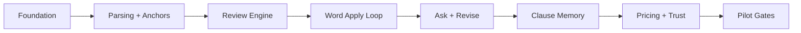

# Solo-First, Word-Native Contract Copilot - v1 Product Contract and Engineering Backlog

Status: Draft
Updated: 2026-04-20
Audience: Product, engineering, design, and pilot planning
Related:
- `docs/specs/open-contracts-engineering-spec.md`
- `docs/specs/open-contracts-endpoint-contracts.md`
- `docs/specs/open-contracts-word-addin-wireframes.md`

This document resets Skua v1 around a narrow wedge: a Word-native contract copilot for solo lawyers and very small firms. It intentionally replaces the broader due diligence and workspace-first direction as the primary v1 product story.

If a proposed feature does not directly improve review, ask, revise, citations, saved fallback language, memory, or cost control, it is out of scope until after first pilots.

## 1. Executive Summary

Skua v1 is a Word add-in that helps a lawyer:

- review a contract against a narrow playbook
- ask a cited question about the current document
- revise a selected clause into suggested language
- save preferred clause language for later reuse

The web app exists only to support that workflow. It is not a second primary product.

The shortest credible path to pilot is:



## 2. v1 Product Contract

### 2.1 Primary users

- Solo lawyers
- Firms with 2-5 lawyers

### 2.2 Primary jobs to be done

- Review document
- Ask cited question
- Revise clause
- Save preferred clause

### 2.3 Product surfaces

- Primary surface: Word add-in
- Support surface: thin web app only

### 2.4 Supported contract types

Skua v1 supports exactly three contract families for structured review. Other documents may still ingest, but they are out of scope for playbook-quality review claims.

| Contract type | v1 review orientation | Why this is in scope |
| --- | --- | --- |
| NDA / confidentiality agreement | recipient-side or mutual NDA review | common, short, high frequency, clause-anchorable |
| Services agreement / MSA / consulting agreement | customer-side review of vendor paper | high-value negotiation surface for small firms |
| SaaS / software subscription agreement | customer-side review of vendor paper | close fit with clause redlines, privacy, and cost control |

### 2.5 User-visible output rules

- Every model output shown to the user must either:
  - include at least one source anchor and citation, or
  - be explicitly labeled as `Suggested draft`
- Ask answers must stay short and factual.
- Revise outputs must be labeled `Suggested language`.
- Review findings must not display without a source segment.
- Unsupported factual claims must be refused, not guessed.
- When confidence is low, the UI should show lower confidence, not hide uncertainty.

### 2.6 Success criteria for a credible pilot

A pilot user should be able to:

- sign in from Word
- sync the current document or selection
- run a cited review over the document
- jump from a finding to the best current clause location
- apply a comment or tracked-change redline
- ask a cited question against the document
- revise a selected clause into suggested language
- save fallback language into a reusable clause bank
- understand what data is stored, what the provider sees, and what the run cost

### 2.7 Explicit non-goals for v1

- Broad legal research
- Due diligence workspace expansion
- Multi-reviewer collaboration beyond basic workspace membership
- Benchmark or compare-to-market workflows
- Standards governance
- Enterprise admin, SSO, or SCIM
- Agent orchestration for its own sake

## 3. Supported Contract Types and Must-Catch Issues

These are the initial must-catch issue maps for v1 playbooks. They are intentionally opinionated and narrow. P3-6 should validate and revise them with an evaluation set before pilot release.

### 3.1 NDA / confidentiality agreement

Initial must-catch issue categories:

- Definition of confidential information is overbroad or underdefined
- Permitted use is too broad or not limited to the stated purpose
- Recipient sharing rights are too broad or lack advisor and affiliate guardrails
- Compelled disclosure process is missing or weak
- Residuals carve-out is present and too favorable to the disclosing party or recipient
- Return or destruction obligations are missing, impractical, or incomplete
- Confidentiality term or survival period is missing or unfavorable
- Reverse engineering, non-solicit, or no-contact restrictions are added as stealth extras
- Ownership, feedback, or derivative-use language is overreaching
- Publicity or announcement restrictions are missing or asymmetric
- Injunctive relief or remedies are one-sided or overbroad
- Assignment or change-of-control language is too restrictive or missing carve-outs
- Governing law, venue, or dispute process is unfavorable

### 3.2 Services agreement / MSA / consulting agreement

Initial must-catch issue categories:

- Scope definition or statement-of-work incorporation is unclear
- Acceptance criteria are missing or too vendor-friendly
- Fees, expenses, late charges, or payment timing are unfavorable
- Auto-renewal or term commitment is too sticky
- Termination for convenience, cure rights, or transition support are missing
- Suspension rights are overbroad
- Work product ownership, background IP, or license-back language is unfavorable
- Confidentiality obligations are weak or inconsistent
- Data security, privacy, or incident notice language is missing or weak
- Service levels, delivery milestones, or staffing commitments are missing
- Subcontracting, delegation, or personnel substitution rights are too broad
- Indemnities are missing, one-sided, or mis-scoped
- Limitation of liability cap or carve-outs are unfavorable
- Exclusivity, non-solicit, or non-compete language creeps in
- Assignment, change of control, or subcontract transfer rights are too broad

### 3.3 SaaS / software subscription agreement

Initial must-catch issue categories:

- Subscription scope, user limits, or affiliate use rights are unclear
- Service description, feature commitments, or roadmap disclaimers are unfavorable
- Fees, true-ups, unilateral price increases, or overage mechanics are unfavorable
- Auto-renewal notice windows or renewal pricing are unfavorable
- Suspension rights, termination rights, or reinstatement conditions are too vendor-friendly
- Customer data use rights, analytics rights, or AI training rights are overbroad
- Security commitments, breach notice timing, or audit rights are weak
- DPA, subprocessor, or cross-border transfer commitments are missing or weak
- Service level commitments, support obligations, or credit remedies are weak
- Intellectual property, feedback, or usage-data ownership is overreaching
- Indemnities are missing, one-sided, or carve out the wrong claims
- Limitation of liability cap or carve-outs are unfavorable
- Data export, retention, deletion, or transition assistance is weak
- Publicity, logo use, or benchmarking restrictions are unfavorable
- Assignment, change of control, or subcontracted hosting rights are too broad

## 4. UX Contract

### 4.1 Word add-in must keep only these first-class areas

- Review
- Ask
- Revise
- Saved clauses
- Settings

### 4.2 Thin web app must stay support-only

The web app may support:

- sign-in and workspace access
- matter and document list views
- run history and basic status views
- clause bank CRUD
- provider settings, billing, usage, and deletion controls
- privacy and trust information

The web app may not become the main drafting or review workflow for v1.

### 4.3 Review output contract

- Findings are structured, ranked, and filterable.
- Each finding includes explanation, source preview, and at least one citation.
- Each actionable finding includes a comment artifact, a redline artifact, or both.
- Informational findings remain visibly distinct from apply-ready findings.

### 4.4 Ask output contract

- Answers are concise.
- Answers include one to three citations.
- Answers do not claim unsupported facts.
- Answers behave like contract-grounded QA, not open-ended chat.

### 4.5 Revise output contract

- Rewrites are always labeled `Suggested language`.
- Rewrites include rationale plus citations where applicable.
- The user can insert, replace, or copy the result.
- When the model cannot support a factual premise, it must ask for instruction or produce only clearly labeled draft language.

## 5. Current Repo Surface Disposition

Every visible repo surface should be marked keep, defer, or remove during the reset.

| Current surface | Decision | Direction |
| --- | --- | --- |
| `apps/word-addin` | Keep | Primary UI. Narrow tabs and flows to the v1 UX contract. |
| `apps/web` | Keep, rename | Becomes `apps/web`. Remove DD-first flows and keep only support workflows. |
| `apps/chat` | Remove | No separate chat-first surface in v1. |
| `services/api` | Keep, rename | Becomes `services/api`. Preserve useful ingest and run logic, but refactor around contract copilot entities. |
| `services/worker` | Keep | Background parse, indexing, review, ask, revise, and cleanup jobs. |
| `services/gateway` | Defer | Keep as lightweight internal code until provider abstraction and BYOK justify a separate runtime boundary. |
| `packages/playbooks` | Keep | Rewrite around the three v1 contract families and structured rule schemas. |
| `packages/prompts` | Keep | Version prompt templates and fragments. |
| `packages/schemas` | Keep, refactor | Split shared runtime schemas from UI-safe shared types. |
| `packages/sdk` | Keep if thin | Preserve only thin typed clients used by add-in and web surfaces. |
| `packages/standards` | Defer | Standards governance is not a v1 product claim. |
| `packages/workflows` | Remove from v1 runtime | DD workflow templates are outside the v1 wedge. Archive if useful, but do not extend. |
| `docs/specs/open-contracts-engineering-spec.md` | Superseded for v1 scope | Keep for historical context only. |

### 5.1 Target monorepo shape

Minimum steady-state shape:

```text
apps/
  word-addin/
  web/
services/
  api/
  worker/
packages/
  shared-types/
  ui/
  playbooks/
  prompts/
  schemas/
  sdk/
```

Rules:

- Do not keep parallel product stories alive in separate apps.
- Do not create a platform service unless it clearly reduces review, ask, revise, memory, or cost-control risk.
- Do not add a new package without a clear ownership boundary.
- Prefer moving current code incrementally over rewriting everything at once.

## 6. Domain Model and System Boundaries

The minimum domain model for v1 is:

- `users`: authenticated end users
- `workspaces`: one default workspace per user, with room for small-firm membership
- `memberships`: user-to-workspace role mapping
- `provider_configs`: hosted or BYOK provider credentials and policy
- `matters`: client matter or deal container for document context
- `documents`: logical document record
- `document_versions`: immutable uploaded or synced versions with SHA-256 hash
- `parsed_documents`: normalized parse output metadata and quality flags
- `document_segments`: heading, clause, paragraph, and table segments
- `anchors`: relocatable source pointers based on quote and neighborhood context
- `playbooks`: structured rule packs for supported contract types
- `review_runs`: persisted review execution records
- `findings`: structured review findings
- `citations`: source support for findings, ask answers, and revise outputs
- `ask_runs`: persisted ask execution records
- `ask_answers`: rendered ask responses
- `revise_runs`: persisted revise execution records
- `clause_bank_entries`: saved fallback language and reusable clauses
- `preference_signals`: accepted, edited, dismissed, and saved user actions
- `artifacts`: generated comments, redlines, exports, and other derived files
- `apply_events`: receipts for comments, redlines, inserts, replaces, and dismissals
- `usage_ledger`: per-run token, provider, and cost accounting
- `audit_events`: actor/entity/timestamp event trail

Boundary rules:

- Source files live in object storage, not on local disk.
- Generated artifacts are stored separately from source documents.
- The server owns run records, citations, and audit state.
- Word remains the place where the live document is edited.
- Apply actions from Word are treated as receipts against a run, not as the canonical edited document state.

## 7. Build Rules

These rules govern backlog execution:

- Primary surface: Word add-in
- Support surface: thin web app only
- First supported contract types: three max
- First supported users: solos and 2-5 lawyer firms
- Every model output shown to the user must have a source anchor or be labeled as a suggested draft
- No new platform work unless it directly improves review, ask, revise, citations, memory, or cost control
- No work on the hard-no list while the backlog below remains incomplete

## 8. Dependency-Ordered Backlog

### Phase 1 - Scope Freeze and Repo Reset

Goal: stop product drift and make the repo shape match the solo-first product.

#### P0-1. Freeze v1 feature scope

Depends on: none

Tasks:

- Define v1 jobs:
  - review document
  - ask cited question
  - revise clause
  - save preferred clause
- Define the three supported contract types listed in this document.
- Define the initial must-catch issue categories per contract type.
- Define represented-party defaults for each playbook.
- Remove v1-excluded work from the active roadmap:
  - DD workspace
  - multi-reviewer collaboration
  - benchmark or compare-to-market
  - standards governance
  - enterprise admin
- Mark every current repo surface keep, defer, or remove.

Acceptance:

- One written v1 product contract exists.
- The active roadmap matches that product contract.
- Every existing repo surface is marked keep, defer, or remove.

#### P0-2. Refactor repo boundaries

Depends on: P0-1

Tasks:

- Split current code into:
  - `/apps/word-addin`
  - `/apps/web`
  - `/services/api`
  - `/services/worker`
  - `/packages/shared-types`
  - `/packages/ui`
- Keep playbooks, prompts, and schemas in versioned packages.
- Identify oversized files and break them apart by domain.
- Add `.env.example` files.
- Add local bootstrap scripts.
- Preserve compatibility aliases only when they reduce migration pain.

Acceptance:

- A new engineer can clone, configure, and run the stack from a clean README.
- No core module is so large that it cannot realistically be code reviewed.
- The repo shape matches the intended product boundaries.

#### P0-3. Hide non-v1 UI

Depends on: P0-1

Tasks:

- Remove or hide unfinished tabs and mock-backed flows.
- Keep only:
  - Review
  - Ask
  - Revise
  - Saved clauses
  - Settings, billing, and providers
- Make the web app support-only.
- Remove DD-first language from user-facing copy.

Acceptance:

- The user-facing flow is coherent.
- The visible UI matches the v1 product contract.

### Phase 2 - Platform Foundation

Goal: replace prototype-local assumptions with a deployable base.

#### P1-1. Data model and migrations

Depends on: P0-2

Tasks:

- Create a Postgres schema for:
  - users
  - workspaces
  - memberships
  - provider configs
  - matters
  - documents
  - document versions
  - parsed documents
  - document segments
  - anchors
  - playbooks
  - review runs
  - findings
  - citations
  - ask runs and answers
  - revise runs
  - clause bank
  - preference signals
  - artifacts
  - apply events
  - usage ledger
  - audit events
- Add migrations.
- Add seed data for local development.

Acceptance:

- Fresh database setup works from one command.
- The schema supports end-to-end ingest, review, ask, revise, apply, and save-clause flows.

#### P1-2. Auth and workspace model

Depends on: P1-1

Tasks:

- Add authentication:
  - magic link or email/password
- Add workspace model:
  - one default workspace per user
  - small-firm-ready membership table
- Add role model:
  - owner
  - admin
  - member
- Add workspace-scoped auth middleware.

Acceptance:

- Users can sign in.
- Users can create or access a workspace.
- Users can only see their own workspace data.

#### P1-3. File storage and object lifecycle

Depends on: P1-1

Tasks:

- Add object storage for uploaded source files.
- Store generated artifacts separately from source files.
- Add deletion routines:
  - document delete
  - matter delete
  - artifact cleanup
  - provider config removal
- Add SHA-256 hashing for document versions.

Acceptance:

- Uploaded documents persist outside local disk.
- Generated artifacts persist independently.
- Deleting a document updates both app state and storage state.

#### P1-4. Queue and worker infrastructure

Depends on: P1-1

Tasks:

- Add Redis.
- Add one queue framework.
- Define job types:
  - `parse_document`
  - `index_document`
  - `run_review`
  - `run_ask`
  - `run_revise`
  - `maintenance_cleanup`
- Add retries and dead-letter handling.
- Add job status observability hooks.

Acceptance:

- Long-running jobs do not block the API.
- Failures are recoverable and observable.

#### P1-5. CI, staging, and observability

Depends on: P1-2, P1-3, P1-4

Tasks:

- Add CI:
  - lint
  - typecheck
  - tests
  - migration check
- Add a staging environment.
- Add error tracking and structured logs.
- Add request IDs and job IDs.

Acceptance:

- The merge pipeline enforces a minimum quality bar.
- Failures can be traced from UI action to backend job.

### Phase 3 - Document Ingestion, Parsing, and Anchors

Goal: make source handling trustworthy enough for legal review.

#### P2-1. Ingestion API

Depends on: P1-3, P1-4

Tasks:

- Support upload from:
  - Word add-in full document
  - Word add-in selection
  - web upload
- Create matter, document, and document version rows.
- Enqueue parse job automatically.

Acceptance:

- New documents arrive in storage.
- New documents appear in app state with parse status.

#### P2-2. DOCX parser

Depends on: P2-1

Tasks:

- Extract paragraph order.
- Preserve heading styles.
- Detect tables.
- Record paragraph-level metadata.
- Preserve stable structural identifiers where available from DOCX or OOXML.

Acceptance:

- DOCX contracts are segmented into usable clauses and paragraphs with reproducible ordering.

#### P2-3. PDF parser

Depends on: P2-1

Tasks:

- Extract pages and text blocks.
- Detect reading order as well as practical.
- Segment into paragraph-like blocks.
- Tag low-confidence regions.

Acceptance:

- PDFs produce usable text and anchors, even if lower quality than DOCX.

#### P2-4. Segmenter and anchor model

Depends on: P2-2, P2-3

Tasks:

- Create `DocumentSegment` entries for:
  - heading
  - clause
  - paragraph
  - table
- Define anchor JSON:
  - document version id
  - ordinal
  - quote
  - prefix
  - suffix
  - page if available
- Build anchor relocation strategy:
  - exact match
  - quote match
  - fuzzy neighborhood match

Acceptance:

- Findings can point to a stable source location.
- Re-location works after small user edits.

#### P2-5. Embeddings and indexing

Depends on: P2-4

Tasks:

- Add `pgvector`.
- Embed selected segment types.
- Add lexical fallback search.
- Store indexing status per document version.

Acceptance:

- Ask, revise, and retrieval can query relevant segments quickly.

#### P2-6. Parse QA harness

Depends on: P2-2, P2-3, P2-4

Tasks:

- Build a test corpus of representative contracts.
- Create golden parse fixtures.
- Test:
  - heading detection
  - clause boundary quality
  - table handling
  - anchor consistency

Acceptance:

- Parse regressions are caught before release.

### Phase 4 - Review Engine

Goal: produce structured findings with exact support.

#### P3-1. Playbook schema

Depends on: P1-1

Tasks:

- Define a structured JSON schema for playbooks:
  - contract type
  - represented party
  - issue rules
  - must-have clauses
  - preferred fallback language
  - severity mapping
- Create three starter playbooks for the v1 contract types.

Acceptance:

- Review runs can reference a playbook and validate input.

#### P3-2. Review run pipeline

Depends on: P2-5, P3-1, P1-4

Tasks:

- Implement `run_review`.
- Pipeline:
  - fetch relevant segments
  - attach playbook rules
  - call provider
  - receive structured output
  - write findings
  - write citations
- Add run status transitions:
  - queued
  - running
  - failed
  - completed

Acceptance:

- A full-document review produces stored findings with linked citations.

#### P3-3. Finding schema and validation

Depends on: P3-2

Tasks:

- Define structured finding payload:
  - type
  - title
  - severity
  - confidence
  - explanation
  - proposed action
  - source segments
- Add validation:
  - no finding without source segment
  - no citation without matching quote
  - no unsupported explanation text

Acceptance:

- Unsupported or malformed findings are rejected before display.

#### P3-4. Comment and redline generation

Depends on: P3-2

Tasks:

- For each actionable issue:
  - generate comment text
  - optionally generate revised clause text
- Distinguish:
  - informational findings
  - comment findings
  - redline findings
- Store apply-ready artifacts separately from raw model responses.

Acceptance:

- Every actionable finding includes a usable apply artifact.

#### P3-5. Ranking and filtering

Depends on: P3-3, P3-4

Tasks:

- Rank findings by:
  - severity
  - confidence
  - playbook priority
  - user preference signals
- Add filter metadata:
  - issue type
  - severity
  - clause type
  - actionable or informational

Acceptance:

- The UI can show high-value findings first.

#### P3-6. Review eval harness

Depends on: P3-2, P3-3

Tasks:

- Build an evaluation set for the first three contract types.
- Label:
  - must-catch issues
  - issue type
  - expected support segment
- Measure:
  - issue precision
  - issue recall
  - citation correctness

Acceptance:

- Review quality is measurable release over release.

### Phase 5 - Ask and Revise Engines

Goal: support cited Q&A and clause rewriting without turning into generic chat.

#### P4-1. Ask pipeline

Depends on: P2-5, P1-4

Tasks:

- Implement `run_ask`.
- Inputs:
  - question
  - document version
  - optional selection scope
- Outputs:
  - concise answer
  - confidence
  - one to three citations

Acceptance:

- A user can ask a question against a document and get a cited answer.

#### P4-2. Revise pipeline

Depends on: P2-5, P1-4

Tasks:

- Implement `run_revise`.
- Inputs:
  - selected clause
  - instruction
  - optional playbook context
  - optional clause bank context
- Outputs:
  - revised text
  - rationale
  - citations

Acceptance:

- A user can request a clause rewrite and receive draftable text with support.

#### P4-3. Scope-aware retrieval

Depends on: P4-1, P4-2

Tasks:

- Prefer selection-local retrieval first.
- Fall back to document-local retrieval.
- Optionally use clause bank entries where relevant.

Acceptance:

- Ask and revise respect the user’s current clause context.

#### P4-4. Output guardrails

Depends on: P4-1, P4-2

Tasks:

- Enforce short-answer format for Ask.
- Enforce explicit `Suggested language` labeling for Revise.
- Refuse unsupported factual claims.
- Log hallucination-like failures for review.

Acceptance:

- Ask and revise behave like a contract tool, not a generic chatbot.

### Phase 6 - Word Add-in Core Experience

Goal: make the product actually usable in the lawyer’s real workflow.

#### P5-1. Auth and session in add-in

Depends on: P1-2

Tasks:

- Add sign-in flow.
- Store secure session state.
- Associate the current document session with matter and document version.

Acceptance:

- A user can sign in and access their workspace from Word.

#### P5-2. Document sync from Word

Depends on: P2-1

Tasks:

- Upload the current document from Word.
- Upload selection text for scoped ask and revise.
- Detect changed document state.
- Prevent accidental duplication where practical.

Acceptance:

- The add-in can reliably send current state to the backend.

#### P5-3. Review panel

Depends on: P3-5, P5-2

Tasks:

- Show findings list.
- Show filters.
- Show explanation and source preview.
- Show apply actions:
  - comment
  - redline
  - dismiss
  - save clause

Acceptance:

- A user can run a review and work through findings without leaving Word.

#### P5-4. Ask panel

Depends on: P4-1, P5-2

Tasks:

- Add question input.
- Add full-document versus selection-scope chooser.
- Show cited answer cards.

Acceptance:

- A user can ask document-grounded questions in Word.

#### P5-5. Revise panel

Depends on: P4-2, P5-2

Tasks:

- Add rewrite instruction UI.
- Show alternatives if available.
- Support insert, replace, and copy actions.

Acceptance:

- A user can revise clauses without copy-paste into outside tools.

#### P5-6. Apply actions

Depends on: P5-3, P5-5

Tasks:

- Apply Word comments.
- Apply tracked-change redlines.
- Insert fallback language.
- Add undo or rollback where feasible.
- Write apply-event receipts and audit events.

Acceptance:

- Applied output lands correctly in the document.

#### P5-7. Anchor relocation in Word

Depends on: P2-4, P5-6

Tasks:

- Given a finding citation, locate the current clause in the edited document.
- Fall back gracefully when exact anchor resolution fails.
- Show `Best match` warning when needed.

Acceptance:

- Source navigation still works after moderate document edits.

#### P5-8. Add-in QA matrix

Depends on: P5-6, P5-7

Tasks:

- Test:
  - Word Mac desktop
  - Word Windows desktop
  - long documents
  - tracked changes on and off
  - heavily edited drafts
- Record incompatibilities.

Acceptance:

- Known Word failure cases are documented and bounded.

### Phase 7 - Clause Bank and Preference Memory

Goal: make the product feel personal and improve over repeated use.

#### P6-1. Clause bank CRUD

Depends on: P1-1

Tasks:

- Create, save, edit, and delete clause bank entries.
- Tag by:
  - contract type
  - issue type
  - represented party
- Save from:
  - manual entry
  - accepted suggestion
  - selected document text

Acceptance:

- Users can build a reusable personal fallback library.

#### P6-2. Clause retrieval in revise and review

Depends on: P6-1, P4-2, P3-4

Tasks:

- Retrieve matching clauses during revise.
- Surface preferred language during review for relevant issues.
- Rank user clauses above generic defaults.

Acceptance:

- Saved clauses actually influence the product experience.

#### P6-3. Preference signals

Depends on: P6-1, P5-6

Tasks:

- Record:
  - accepted suggestions
  - dismissed findings
  - saved clauses
  - edited revisions
- Store signals for later ranking.

Acceptance:

- Product behavior can adapt to repeated user choices.

#### P6-4. Lightweight ranking layer

Depends on: P6-3

Tasks:

- Rank findings and suggestions using:
  - playbook priority
  - clause bank matches
  - preference signals
- Keep ranking rules interpretable.

Acceptance:

- Preferred user language appears earlier over time.

### Phase 8 - Pricing, BYOK, and Usage Control

Goal: match the solo value proposition: cost control and transparency.

#### P7-1. Provider abstraction layer

Depends on: P3-2, P4-1, P4-2

Tasks:

- Standardize the provider interface for:
  - review
  - ask
  - revise
  - embeddings
- Support hosted provider mode first.
- Support model policy configuration.
- Keep the abstraction in-process until a standalone gateway is justified.

Acceptance:

- Core jobs can swap models without rewriting application logic.

#### P7-2. BYOK support

Depends on: P7-1, P1-2

Tasks:

- Add encrypted provider config storage.
- Support workspace-level BYOK.
- Validate keys.
- Enforce provider-specific limits.

Acceptance:

- Users can run jobs with their own provider credentials.

#### P7-3. Usage ledger

Depends on: P7-1

Tasks:

- Record per run:
  - provider
  - model
  - token counts
  - estimated cost
  - actual cost
- Add workspace monthly rollup.

Acceptance:

- Usage and cost are auditable per run and per month.

#### P7-4. Spend estimates and caps

Depends on: P7-3

Tasks:

- Estimate cost before run using:
  - selected scope
  - segment count
  - provider pricing table
- Add:
  - warning thresholds
  - hard monthly cap
  - per-run abort if over estimate threshold

Acceptance:

- Users can predict and limit spend.

#### P7-5. Billing surface

Depends on: P7-3, P7-4

Tasks:

- Add plan model:
  - hosted
  - BYOK
- Show current month usage.
- Show warnings and overages.

Acceptance:

- Pricing behavior matches the promised value proposition.

### Phase 9 - Trust, Deletion, Audit, and Supportability

Goal: make the product credible enough for real client work by solos.

#### P8-1. Audit events

Depends on: P1-1

Tasks:

- Log key actions:
  - document upload
  - review run
  - ask run
  - revise run
  - applied edit
  - saved clause
  - deletion
- Store actor, entity, and timestamp.

Acceptance:

- Important actions are reconstructable.

#### P8-2. Deletion and retention basics

Depends on: P1-3, P8-1

Tasks:

- Add document delete.
- Add matter delete.
- Add provider config removal.
- Define a minimal retention policy.

Acceptance:

- Users can remove their data without manual engineering intervention.

#### P8-3. Trust surface

Depends on: P8-1, P8-2, P7-2

Tasks:

- Build a user-facing privacy and trust page.
- Show:
  - what is stored
  - what providers see
  - whether data is used for training
  - delete behavior
  - BYOK behavior

Acceptance:

- A cautious solo can understand the data posture quickly.

#### P8-4. Support and admin basics

Depends on: P1-5

Tasks:

- Add internal admin views for:
  - job failures
  - parse failures
  - usage anomalies
  - user support lookup
- Add feature flags.

Acceptance:

- Early pilots can be supported without direct database surgery.

### Phase 10 - Quality Gates and Pilot Readiness

Goal: convert engineering work into something that can survive real use.

#### P9-1. End-to-end tests

Depends on: phases 2 through 9 core tickets

Tasks:

- Test full flows:
  - upload doc
  - parse and index
  - run review
  - apply comment
  - ask question
  - revise clause
  - save clause
  - re-run review
- Include failure-path tests.

Acceptance:

- Core user flows pass in CI and staging.

#### P9-2. Release criteria dashboard

Depends on: P1-5, P3-6

Tasks:

- Track:
  - parse success rate
  - review failure rate
  - citation validation failure rate
  - add-in apply failure rate
  - accepted suggestion rate
  - average run cost
- Set thresholds for release.

Acceptance:

- `Ready for pilot` is measurable, not intuitive.

#### P9-3. Pilot kit

Depends on: P5-8, P7-5, P8-3

Tasks:

- Create starter playbooks.
- Create onboarding flow.
- Create sample matters and sample docs.
- Create issue reporting flow.

Acceptance:

- A pilot user can onboard without live founder handholding for every step.

## 9. Suggested Execution Order

### First 4 weeks

Ship:

- P0-1 to P0-3
- P1-1 to P1-4
- P2-1 to P2-4

Outcome:

- the minimal structural base exists

### Weeks 5-8

Ship:

- P2-5 and P2-6
- P3-1 to P3-4
- P5-1 to P5-4

Outcome:

- the first real review and ask loop works inside Word

### Weeks 9-12

Ship:

- P3-5 and P3-6
- P4-2 to P4-4
- P5-5 to P5-8
- P6-1

Outcome:

- revise, apply actions, QA coverage, and saved clauses are in place

### Weeks 13-16

Ship:

- P6-2 to P6-4
- P7-1 to P7-5
- P8-1 to P8-4
- P9-1 to P9-3

Outcome:

- memory, pricing, BYOK, trust, and pilot readiness are complete

## 10. Release Priority Buckets

### P0

Must exist before any credible pilot:

- scope freeze
- repo reset
- Postgres, object storage, and queue
- auth and workspace model
- ingest, parse, and anchors
- review engine
- Word review panel
- apply comments and redlines
- citations

### P1

Strongly preferred before charging:

- revise engine
- clause bank
- usage ledger
- spend estimates
- deletion
- trust page
- end-to-end tests

### P2

Can wait until after first paying pilots:

- BYOK
- ranking from preference signals
- richer analytics
- more playbooks
- small-firm multi-user polish

## 11. Hard No List During Backlog Execution

Do not add these while the backlog above remains incomplete:

- broad legal research
- DD workspace expansion
- benchmark or compare-to-market
- elaborate collaboration
- enterprise SSO or SCIM
- AI-agent orchestration for its own sake

These are the easiest ways to lose the solo-first wedge.

## 12. Initial Pilot Release Gates

The release dashboard in P9-2 should own the final numbers, but the initial expectation is:

- DOCX parse success is high enough to support repeatable review on the test corpus.
- Citation validation failure is rare enough that unsupported output is exceptional, not routine.
- Add-in apply failures are low enough that comment and redline actions are trustworthy on the supported matrix.
- Review failure rate is operationally manageable in staging before pilot.
- Hosted average run cost stays inside the intended solo-friendly pricing model.

If those conditions are not true, pilot should slip rather than widen scope.

## 13. Primary Risks and Mitigations

| Risk | Why it matters | Mitigation |
| --- | --- | --- |
| Scope snaps back toward DD workflows | The repo already contains that gravity | Lock the v1 contract early and remove visible DD-first surfaces |
| Anchors drift after edits | Review is only useful if findings can be re-located | Invest early in quote, prefix/suffix, and fuzzy neighborhood matching |
| PDF quality drags down trust | Poor segmentation breaks citations | Treat PDF as lower-confidence and label it accordingly |
| Ask and revise become generic chat | Trust and product clarity collapse | Enforce citation rules, short answers, and suggested-draft labeling |
| Word apply flows break on real documents | The Word loop is the product | Build the QA matrix and track apply failure rate explicitly |
| Hosted costs spike | Solos care about predictability | Add usage ledger, cost estimation, and caps before broad pilot expansion |
| BYOK adds too much complexity too early | It can delay the core hosted experience | Keep BYOK as P2 unless pilots demand it |

## 14. Immediate Next Actions

1. Adopt this document as the v1 scope contract.
2. Rename the active product story from DD workspace to Word-native contract copilot.
3. Convert the keep, defer, and remove decisions into concrete repo tickets.
4. Delete or hide non-v1 tabs before adding new product work.
5. Start Phase 2 only after the scope reset is reflected in the repo and roadmap.

## 15. Bottom Line

The critical path is:

foundation -> parsing and anchors -> review engine -> Word apply loop -> ask and revise -> clause memory -> pricing and trust -> pilot gates

That is the shortest path from the current repo shape to a product a solo lawyer might actually pay for instead of a flat-fee incumbent.
